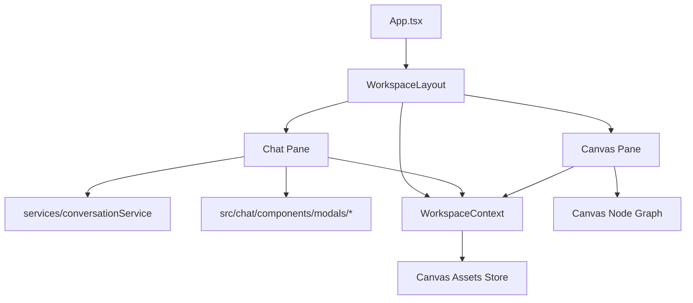

# 技术设计: 双栏工作台（画布 + 对话）联动

## 技术方案
### 核心技术
- React + TypeScript + Vite（保持现状）
- 新增 `Workspace` 作为顶层容器，使用 Flex + 可拖拽分割条实现左右分栏
- 使用 React Context（或轻量事件总线）实现 Chat 与 Canvas 的跨面板通信

### 推荐实现（最小变更、最大兼容）
1. **沿用现有 `Canvas.tsx` 节点画布能力**，在其节点体系内新增“媒体资产节点”用于承载 Chat 产生的图片/GIF/视频。
2. **ChatView 不改核心业务逻辑**，仅做：
   - “容器化尺寸适配”（从 `w-screen h-screen` 改为 `w-full h-full`）
   - 在会话切换与消息产出时，将媒体资产上报到 Workspace（或由 Workspace 从会话数据派生）
3. **媒体资产与画布节点关系**：
   - Workspace 维护 `activeConversationId`
   - Workspace 维护 `assetsByConversationId`（资产元信息列表）
   - Canvas 从 Workspace 获取当前会话的资产列表，映射/合并到 Canvas 节点（新增或更新）

## 架构设计

## 架构决策 ADR
### ADR-001：媒体同步的“真源”选择
- **决策**：图片/GIF 优先从会话消息（`conversationService` 的 `imageResponses`）派生；视频/工具产物通过 Workspace 事件上报补充。
- **理由**：避免改动会话存储结构导致的 IndexedDB 数据迁移风险；兼容现有历史对话；只对工具产物做增量补齐。
- **替代方案**：扩展 `Message` Schema 增加 `attachments[]`（支持 video/gif 等）并做版本迁移。拒绝原因：改动面更大且需要迁移策略。

### ADR-002：画布与会话的绑定关系
- **决策（默认）**：画布资产列表按会话隔离（随 `selectedConversation` 切换）。
- **理由**：Chat 已具备多会话能力；“对话产物沉淀到画布”更符合每个会话一个工作台的直觉。
- **可选增强**：提供“全局资产库”视图（跨会话聚合）作为后续迭代。

### ADR-003：画布资产的持久化策略
- **决策（V1）**：仅内存态（页面刷新丢失）+ 依赖现有会话历史可重建图片/GIF；工具产物（Blob）先不强制持久化，提供“下载/导出”能力。
- **理由**：现有 Canvas 节点位置/连线本身也未持久化；先交付联动与结构，后续按需要升级到 IndexedDB。
- **后续可选**：新增 IndexedDB Store 保存 `{conversationId -> canvasState}`（节点、连线、资产 blob）。

## 实现要点
### 1) WorkspaceLayout（双栏 + 可拖拽）
- 新增 `src/workspace/WorkspaceLayout.tsx`：
  - `div` Flex Row，左 `CanvasPane`，右 `ChatPane`，中间拖拽分割条
  - 保存分割比例到 `localStorage`（可选）
  - 提供折叠按钮（可选）

### 2) 容器化改造（避免 w-screen/h-screen）
- `Canvas.tsx`：根容器由 `w-screen h-screen` 改为 `w-full h-full`，父容器负责占满视口
- `src/chat/ChatView.tsx`：同上（并检查内部滚动容器是否依赖 `h-screen`）

### 3) WorkspaceContext（跨面板联动）
- 新增 `src/workspace/WorkspaceContext.tsx`：
  - `activeConversationId`
  - `setActiveConversationId(id)`
  - `setChatReferenceMedia(url)`（至少支持图片）
  - `assetsByConversationId` + `upsertAssets(conversationId, assets)`
  - `addToolOutputAsset(conversationId, asset)`（用于 GIF/视频/工具产物）

### 4) 媒体资产模型与去重
- 资产模型（示例）：
  - `id`（稳定：`conversationId + messageId + index` 或 hash）
  - `type`：`image | gif | video | apng`
  - `url`（http/data/blob）
  - `meta`：`modelName/prompt/timestamp/sourceMessageId`
- 去重策略：
  - 同一会话内按 `id` 去重；如果只有 `url`，按 `url + type` 去重

### 5) Canvas 媒体资产节点
- 在 `types.ts` 的 `NodeType` 增加 `MEDIA_ASSET`
- 新增 `components/nodes/MediaNode.tsx`：
  - 根据 `type` 渲染 `` / `<video>`
  - 仅在节点被选中时显示工具栏（按钮集合随 type 变化）
  - 工具栏动作通过 WorkspaceContext 触发（设为参考图、打开工具等）

### 6) 工具产物上报（GIF/视频）
- `Video2GifModal`：在生成 `result` 后增加 “同步到画布” 按钮（或自动），通过 WorkspaceContext 写入当前会话资产
- `Png2ApngModal`：在生成 `apngBlob` 后同上
- `particleize` 录制 webm：在生成 blob 时同上

## 安全与性能
- **安全**：不引入新的外部依赖/网络请求；不保存/输出密钥；保持现有 API_KEY 注入方式不变。
- **性能**：对大量媒体节点采用懒加载（`loading="lazy"`）、在移除/切换时 `URL.revokeObjectURL`。

## 测试与验证
- `vitest`：补充资产派生/去重逻辑的单元测试
- 手工回归清单：
  - Chat 全功能（文本/图片/编辑/工具面板/会话）可用
  - 生成图片/GIF/视频后自动出现在画布
  - 画布节点可选中且工具栏动作可用
  - 会话切换后资产正确切换（按 ADR-002）

