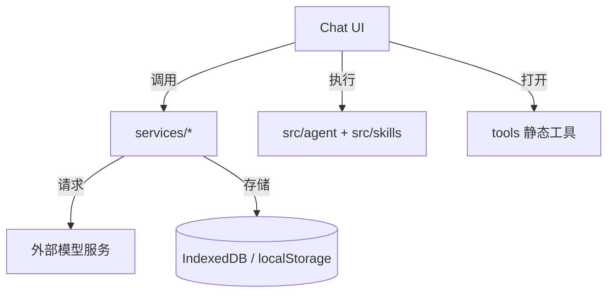
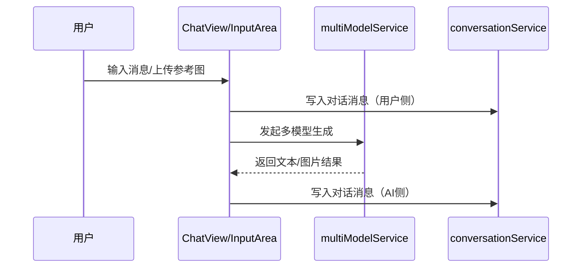

# 架构设计

## 总体架构

## 技术栈
- **前端:** React + TypeScript + Vite
- **数据:** IndexedDB（对话与大数据） + localStorage（备份/索引）
- **外部依赖:** Google GenAI / 其他模型服务（通过服务层封装）

## 核心流程

## 重大架构决策
| adr_id | title | date | status | affected_modules | details |
|--------|-------|------|--------|------------------|---------|

